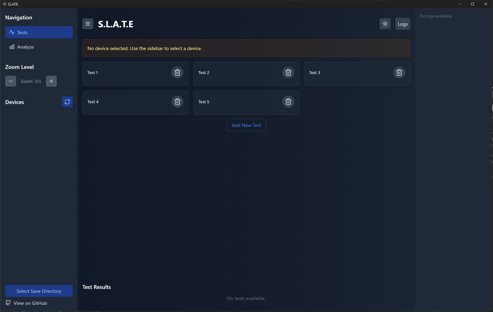
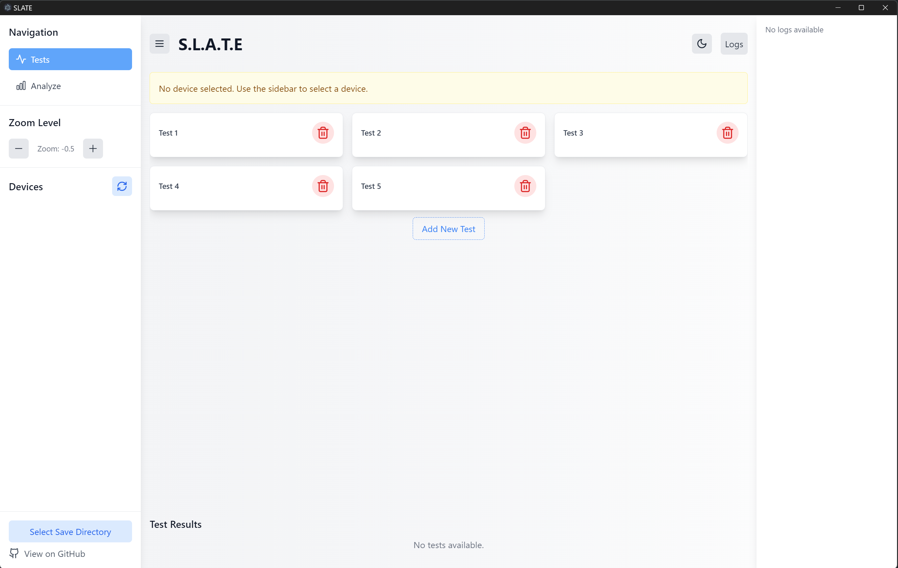

# SLATE 
### (SCPI/LXI Automated Testing Environment)

SLATE is a modern and intuitive application designed to simplify automated testing for instruments using SCPI and LXI protocols. With support for running multiple tests concurrently on different instruments, SLATE streamlines the process of sending commands, chaining commands, and analyzing the results.
Features
- Multi-Instrument Support: Run tests concurrently on multiple instruments.
- Command Automation: Easily send and chain SCPI commands.
- Data Management: Clean up and manipulate output data.
- Graphing and Visualization: Generate graphs from test results or export data for external use.
- User-Friendly Interface: A modern app built with React and Electron for seamless usability.

### Installation

You can use SLATE in two ways:
Ensure you have Node.js installed.
#### Run From Source
1. Clone the repo
``` 
git clone https://github.com/yourusername/slate.git
cd slate
```
2. Install dependencies
```
npm install
```
3. start the app
```
npm run dev
```
#### Download the Packaged Executable
Download the latest packaged version of SLATE for your operating system from the Releases page. Simply download, install, and run the app—no additional setup is needed.


